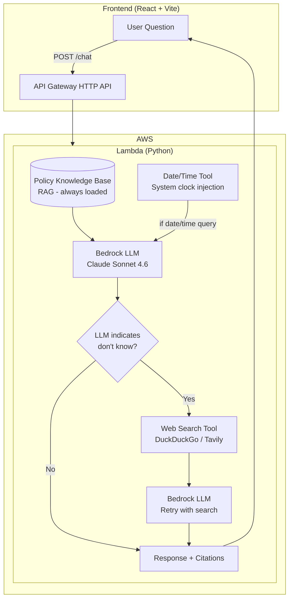

# Policy Knowledge Agent — Architecture & Pipeline

## Pipeline Diagram (Visual)


*Save the generated flowchart to `docs/policy-agent-pipeline-diagram.png` to view it here. The Mermaid diagram below also renders in GitHub and VS Code.*

## Mermaid Diagram (editable source)



## Pipeline Flow (Detailed)

```
┌─────────────────────────────────────────────────────────────────────────────┐
│                         POLICY KNOWLEDGE AGENT PIPELINE                      │
└─────────────────────────────────────────────────────────────────────────────┘

  USER QUESTION
        │
        ▼
┌───────────────────┐
│ 1. Load Context    │  ← Policy KB (RAG): procurement policy, spend thresholds,
│    (always)       │     supplier onboarding, templates — always in system prompt
└─────────┬─────────┘
          │
          ▼
┌───────────────────┐
│ 2. Optional Tool  │  ← Date/Time: only if query is about date/time
│    (date/time)    │     Inject "Current Date: Monday, March 2, 2026" from system
└─────────┬─────────┘
          │
          ▼
┌───────────────────┐
│ 3. First LLM Call │  ← Bedrock (Claude Sonnet 4.6) with policy + optional date
│    (Bedrock)      │
└─────────┬─────────┘
          │
          ▼
┌───────────────────┐     No      ┌─────────────────┐
│ 4. Response says  │───────────►│ Return response  │
│    "don't know"?  │            │ to user         │
└─────────┬─────────┘             └─────────────────┘
          │ Yes
          ▼
┌───────────────────┐
│ 5. Web Search     │  ← DuckDuckGo (default) or Tavily (if API key set)
│    (Tool)         │     Search user's exact question
└─────────┬─────────┘
          │
          ▼
┌───────────────────┐
│ 6. Retry LLM      │  ← Same Bedrock call, now with search results in context
│    with results   │
└─────────┬─────────┘
          │
          ▼
┌───────────────────┐
│ Return response   │  ← Answer from search + citations
│ to user           │
└───────────────────┘
```

## Tools

| Tool | When Used | Description |
|------|-----------|-------------|
| **Policy Knowledge Base (RAG)** | Always | Embedded procurement policy, spend thresholds, supplier onboarding, templates. Loaded into system prompt for every request. |
| **Date/Time Injection** | When query mentions date/time | Injects current date or time from system clock. No web search needed. |
| **Web Search** | When LLM indicates it doesn't know | DuckDuckGo (free) or Tavily (API key). Triggered by phrases like "I don't have that in the knowledge base", "knowledge cutoff", "recommend checking a news source". |
| **Bedrock LLM** | Every request (1–2 calls) | Claude Sonnet 4.6. First call with policy (+ optional date). Second call only if first response triggers web search. |

## Infrastructure

```
Frontend (React)  →  CloudFront  →  S3 (static)
                         │
User Question     →  API Gateway  →  Lambda  →  Bedrock
                         │              │
                         │              ├── DynamoDB (conversations)
                         │              └── Web Search (DuckDuckGo/Tavily)
```

## Trigger Phrases (Web Search Retry)

The LLM triggers a web search retry when its response contains any of:

- "I don't have that information in the knowledge base"
- "Could you rephrase" / "I'm not sure I understand"
- "Knowledge cutoff" / "As of my knowledge"
- "Recommend checking a live news source"
- "Training data" / "Training cutoff"

No keyword list for questions—we let the LLM's answer decide when to search.
